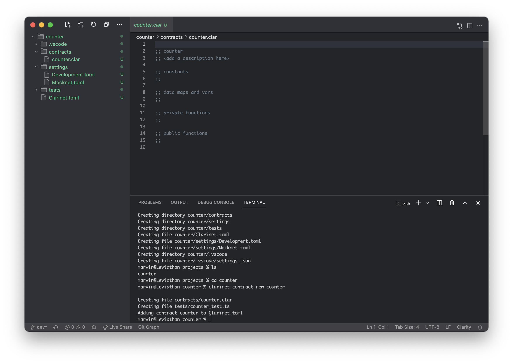

## Creating a new project

For our first project, we will be creating a _multiplayer counter contract_. The
contract will have the following features:

- A data store that keeps a counter per principal.
- A public function `count-up` that increments the counter for `tx-sender`.
- A read-only function `get-count` that returns the current counter value for the
  passed principal.

Once the contract is finished, we will look at how we can interact with the
project manually and how to write automated tests.

### Initialising the project folder

Let us start by creating a new folder that will contain the various projects. We
will simply call it `projects`. Open the folder in Visual Studio Code and open
the built-in terminal emulator by going to the Terminal menu and choosing New
Terminal.

We will create a new project called `counter` using Clarinet. Type the following
in the Terminal screen:

```bash
clarinet new counter
```

Clarinet will create a number of directories and files. We will go over these
files momentarily.

```bash
Creating directory counter
Creating directory counter/contracts
Creating directory counter/settings
Creating directory counter/tests
Creating file counter/Clarinet.toml
Creating file counter/settings/Devnet.toml
Creating file counter/settings/Mocknet.toml
Creating directory counter/.vscode
Creating file counter/.vscode/settings.json
```

The `counter` directory will be our working directory. You can either reopen the
folder in Visual Studio Code or navigate into it in the terminal session with
the command `cd counter`.

### Adding a new contract

Inside the `counter` folder, we create a new Clarity contract with the command:

```bash
clarinet contract new counter
```

Clarinet will create a boilerplate Clarity and test file, and add the contract
to the configuration file.

```bash
Creating file contracts/counter.clar
Creating file tests/counter_test.ts
Adding contract counter to Clarinet.toml
```

Let us now open `Clarinet.toml`. This is the Clarinet configuration file for the
project. It contains a reference to all contract files and their dependencies.
In our case, only one contract is listed, but for multi-contract projects you
can specify their relationship to each other.

```toml
[project]
name = "counter"
requirements = []
[contracts.counter]
path = "contracts/counter.clar"
```

The files found in the `settings` directory are used for deployment:

- `Devnet.toml` contains configuration that is used when running tests and in
  console mode.
- `Testnet.toml` is a template for deploying on a testnet chain.
- `Mainnet.toml` is a template for deploying on a mainnet chain.

We will take a closer look at them later. Their contents are not important for
our project but it is good to know what they are used for.

Here is what the end result looks like. You can see your project files on the
left, the terminal window on the bottom right, and your editor on the top right.
_Please note that the directories shown in the image may differ with the current
version._


