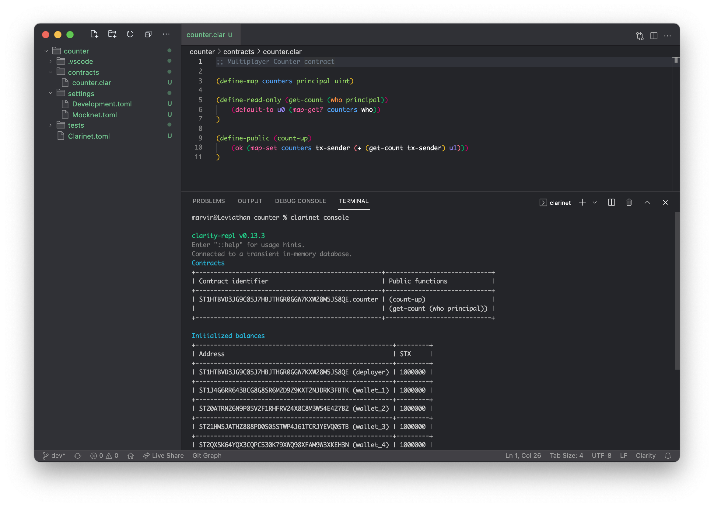

## Interacting with your contract

Clarinet makes it easy run a local mock chain to manually interact with your
contracts. You can start an interactive session just like you can with the
Clarity REPL. When you initiate the session, Clarinet will automatically deploy
your contracts based on the definitions in `Clarinet.toml`. To start the
console:

```bash
clarinet console
```

The console will print a bunch of information. After the Clarinet version, it
shows a table of your currently deployed contracts. It should show the counter
contract that we just created. If it does not, then there is an error in the
code and you should go back to the previous section to figure it out. **You can
exit out of the console at any time by pressing CTRL + D on your keyboard.**

There is a second table that contains a list of addresses and balances. These
are local test wallets that are initialised based on the contents of the
`settings/Devnet.toml` file.



Here is the contract output in text format:

```text
Contracts
+---------------------------------------------------+-----------------------------+
| Contract identifier                               | Public functions            |
+---------------------------------------------------+-----------------------------+
| ST1HTBVD3JG9C05J7HBJTHGR0GGW7KXW28M5JS8QE.counter | (count-up)                  |
|                                                   | (get-count (who principal)) |
+---------------------------------------------------+-----------------------------+
```

### Contract calls

Since the console starts a REPL session, we can use the full power of Clarity to
play around with our contracts. By default, the `tx-sender` is equal to the
first address in the table. (In the image above, it is
`ST1HTBVD3JG9C05J7HBJTHGR0GGW7KXW28M5JS8QE`.) You can of course verify it by
entering `tx-sender` into the console.

Let us try to read the counter value of `tx-sender`. It should be `u0` because
that is the default value we programmed into our contract. The `contract-call?`
function is used to call a public or read-only function in a contract. Its
function signature looks as follow:

```Clarity,{"nonplayable":true}
(contract-call? contract-identifier function-name param-1 param-2 ...)
```

The _contract identifier_ specifies which contract to call. There are three ways
to pass in a contract:

1. A fully qualified
   [contract principal](ch02-01-primitive-types.md#principals). This is a Stacks
   address with a contract name, prefixed by a single quote (`'`). In our
   example, it is:
   ```Clarity,{"nonplayable":true}
   'ST1HTBVD3JG9C05J7HBJTHGR0GGW7KXW28M5JS8QE.counter
   ```

2. A contract specified by shorthand notation. If multiple contracts are
   deployed by the same `tx-sender`, then they can refer to each other without
   including the Stacks address. It is a bit like a relative path:
   ```Clarity,{"nonplayable":true}
   .counter
   ```

3. A trait reference. Those will be covered in the
   [chapter on traits](ch09-00-traits.md).

What follows is the function name and parameters, if any.

In order to call the `get-count` function, we therefore type the following:

```Clarity,{"nonplayable":true}
(contract-call? .counter get-count tx-sender)
```

If everything went well, the console should respond with the expected `u0`.

## Changing the tx-sender

Now that we know how to call functions in our contract, we can try calling
`count-up` and seeing if the counter for the `tx-sender` changes:

```Clarity,{"nonplayable":true}
(contract-call? .counter count-up)
```

Returns `(ok true)`, indicating the call was successful. Reading the counter
status using the call in the last section indeed reveals that the count is now
`u1`!

The console can switch the sending context to any other address. We will pick
the second one, called _wallet 1_, and set it as the `tx-sender`. For this we
use a management command. Those always start with a double colon (`::`):

```Clarity,{"nonplayable":true}
::set_tx_sender ST1J4G6RR643BCG8G8SR6M2D9Z9KXT2NJDRK3FBTK
```

Now we can call into the contract again to verify that the count for this
`tx-sender` is still `u0`. Remember that now that we changed the sending address
to a different one from which the contract was deployed, we have to specify the
full contract principal.

```Clarity,{"nonplayable":true}
(contract-call? 'ST1HTBVD3JG9C05J7HBJTHGR0GGW7KXW28M5JS8QE.counter get-count tx-sender)
```

Great, it works! Now try calling `count-up` a few times. You can play around by
changing the sender a couple of times and by specifying principals for
`get-count`.

Congratulations, you just made and manually tested your first Clarity smart
contract.

## A word on a contract's *context*

In the previous section we describe changing the contract's context. The context
refers to the current state of the contract runtime environment during execution,
including the value of `tx-sender` and the local binding of symbols to values in
the scope of a `let` expression. This information is important because it
determines how the contract will behave and what actions it will take as it is
executed. 
