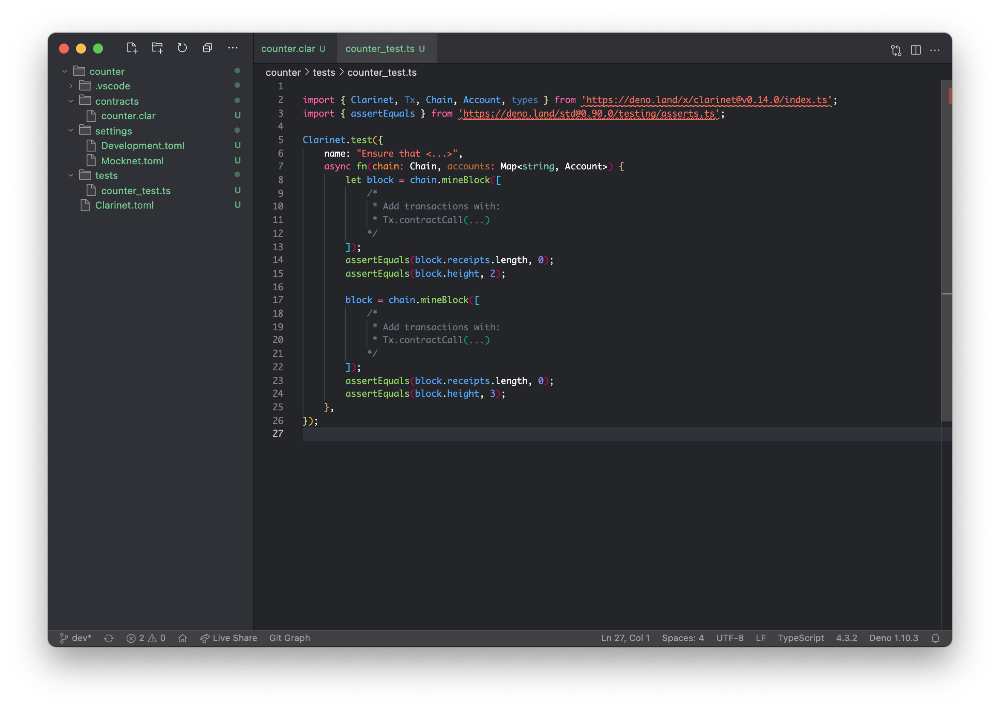

## Testing your contract

Testing software is important and smart contracts are no different. However,
properly testing smart contracts is absolutely crucial as it is impossible to
update them after they have been deployed to the chain. The mantra of the lazy
developer, "we will fix it in post", definitely does not fly with smart
contracts.

Clarinet features a testing framework that allows developers to automate tests.
These tests are written in code and describe the intended functionality of the
smart contract. In this case, that code is written in TypeScript. Covering
TypeScript itself is out of scope for the book but most web developers will be
familiar with it. If you have done some JavaScript then it should also be easy
enough to pick up.

### Unit tests

Clarinet will generate a test file for each contract you instantiate using the
`clarinet new contract` command. In the folder `tests` you will find one for our
counter contract called `counter_test.ts`. Depending on the version of Clarinet
you are using, it should have added some imports and template code to the test
file. You may remove the template code but make sure you leave the `import`
statements intact.



Tests are defined using the `Clarinet.test` function. They have a name, which is
used as a description, and a callback function that is executed on test. Before
each test commences, Clarinet will instantiate a fresh local chain and then run
the function. The function should run one or more contract calls against the
contract to test it. The testing suite makes writing these calls easy but still
uses `contract-call?` Behind the scenes.

In order to write successful tests, we should first think about the _intended
behaviour_ of the contract. That does not only include success states but also
failure states. Remember, behaviour is observed from the outside. We care about
which inputs produce what outputs. How it is implemented is a detail. Let us
describe all of them in bullet point format.

- `get-count` returns `u0` for principals that have never called into
  `count-up`.
- `get-count` returns the number of times a specific principal called into
  `count-up`.
- `count-up` increments the counter for the `tx-sender` as observed by
  `get-count` and returns `(ok true)`.

### Testing get-count

Tests should be kept as simple as possible. You want to test exactly one aspect
of a function call. The reason being that if a bug is later introduced in the
contract, only the tests that specifically target that section of code will
fail. Complex tests that leverage a lot of functionality can fail because of
many different reasons and may make identifying the actual bug a lot more
difficult.

We will therefore start by writing a test for the default behaviour of
`get-count`; namely, it returning `u0` for principals that have never called
`count-up` before.

```typescript
Clarinet.test({
  name: "get-count returns u0 for principals that never called count-up before",
  async fn(chain: Chain, accounts: Map<string, Account>) {
    // Get the deployer account.
    let deployer = accounts.get("deployer")!;

    // Call the get-count read-only function.
    // The first parameter is the contract name, the second the
    // function name, and the third the function arguments as
    // an array. The final parameter is the tx-sender.
    let count = chain.callReadOnlyFn("counter", "get-count", [
      types.principal(deployer.address),
    ], deployer.address);

    // Assert that the returned result is a uint with a value of 0 (u0).
    count.result.expectUint(0);
  },
});
```

We are now ready to execute the test using `clarinet test`. If everything went
well, our test should pass with an "ok" status.

```bash
* get-count returns u0 for principals that never called count-up before ... ok (146ms)
```

### Testing count-up

The next step is to test `count-up`. We will write a minimal test that first
calls `count-up` once, and then check the count using `get-count`. As mentioned,
Clarinet will refresh the chain state for every test so that the starting
conditions are always the same. We therefore know that the first `count-up` call
will always result in the counter for that `tx-sender` to be `u1`.

```typescript
Clarinet.test({
  name: "count-up counts up for the tx-sender",
  async fn(chain: Chain, accounts: Map<string, Account>) {
    // Get the deployer account.
    let deployer = accounts.get("deployer")!;

    // Mine a block with one transaction.
    let block = chain.mineBlock([
      // Generate a contract call to count-up from the deployer address.
      Tx.contractCall("counter", "count-up", [], deployer.address),
    ]);

    // Get the first (and only) transaction receipt.
    let [receipt] = block.receipts;

    // Assert that the returned result is a boolean true.
    receipt.result.expectOk().expectBool(true);

    // Get the counter value.
    let count = chain.callReadOnlyFn("counter", "get-count", [
      types.principal(deployer.address),
    ], deployer.address);

    // Assert that the returned result is a u1.
    count.result.expectUint(1);
  },
});
```

Clarinet simulates the mining process by calling `chain.mineBlock()` with an
array of transactions. The contract call transactions themselves are constructed
using the `Tx.contractCall()`. The Clarinet TypeScript library provides a lot of
helper functions to mine blocks, construct transactions, and create function
arguments. Inspect the source or see the Clarinet documentation for a full
overview.

### Testing the multiplayer aspect

Although the two tests we have written cover all code paths in our smart
contract, it makes sense to add another test that explicitly tests the
multiplayer aspect of our contract.

```typescript
Clarinet.test({
  name: "counters are specific to the tx-sender",
  async fn(chain: Chain, accounts: Map<string, Account>) {
    // Get some accounts
    let deployer = accounts.get("deployer")!;
    let wallet1 = accounts.get("wallet_1")!;
    let wallet2 = accounts.get("wallet_2")!;

    // Mine a few contract calls to count-up
    let block = chain.mineBlock([
      // The deployer account calls count-up zero times.

      // Wallet 1 calls count-up one time.
      Tx.contractCall("counter", "count-up", [], wallet1.address),

      // Wallet 2 calls count-up two times.
      Tx.contractCall("counter", "count-up", [], wallet2.address),
      Tx.contractCall("counter", "count-up", [], wallet2.address),
    ]);

    // Get and assert the counter value for deployer.
    let deployerCount = chain.callReadOnlyFn("counter", "get-count", [
      types.principal(deployer.address),
    ], deployer.address);
    deployerCount.result.expectUint(0);

    // Get and assert the counter value for wallet 1.
    let wallet1Count = chain.callReadOnlyFn("counter", "get-count", [
      types.principal(wallet1.address),
    ], wallet1.address);
    wallet1Count.result.expectUint(1);

    // Get and assert the counter value for wallet 2.
    let wallet2Count = chain.callReadOnlyFn("counter", "get-count", [
      types.principal(wallet2.address),
    ], wallet2.address);
    wallet2Count.result.expectUint(2);
  },
});
```

Let us again run our tests using `clarinet test`. Clarinet will execute all
tests and show us the result. We should get three ok's. If, not then the output
will show you where it went wrong. Edit your code and try again.

```bash
Running counter/tests/counter_test.ts
* get-count returns u0 for principals that never called count-up before ... ok (142ms)
* count-up counts up for the tx-sender ... ok (144ms)
* counters are specific to the tx-sender ... ok (148ms)
```

That concludes our first project. You now know what the entire Clarity smart
contract development flow looks like! The full source code of the counter
project can be found here:
https://github.com/clarity-lang/book/tree/main/projects/counter.
